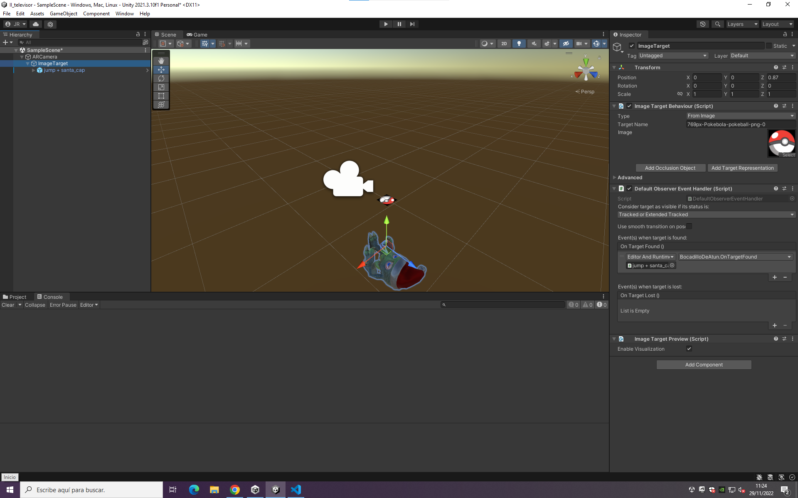
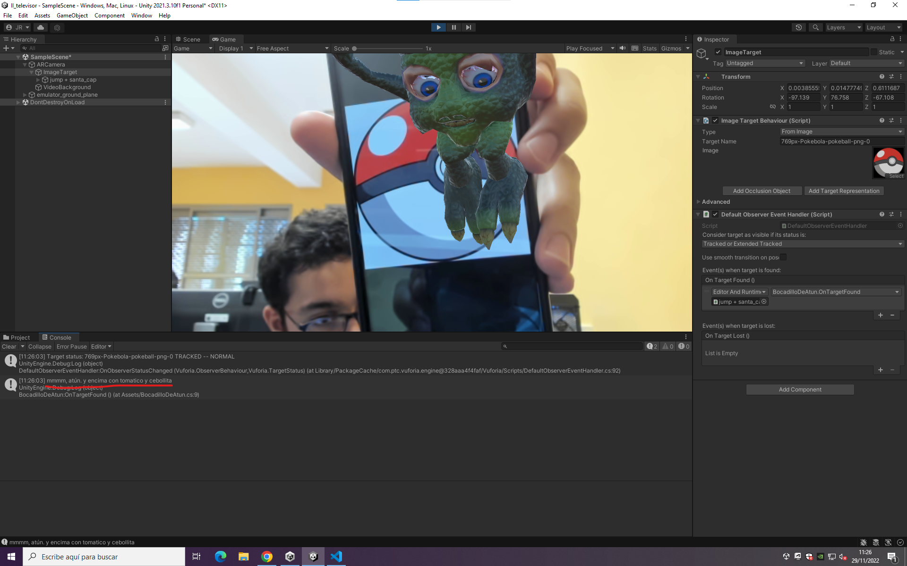

# II_vuforia

## Escena original



## Escena con elemento de realidad aumentada



## Código del evento

```csharp
using System.Collections;
using System.Collections.Generic;
using UnityEngine;

public class BocadilloDeAtun : MonoBehaviour
{
    public void OnTargetFound()
    {
        Debug.Log("mmmm, atún. y encima con tomatico y cebollita");
    }
}
```
